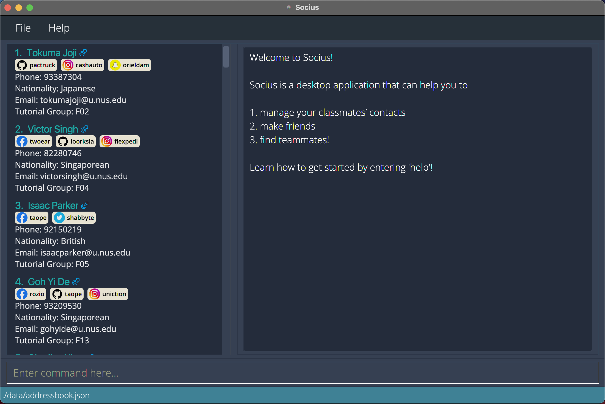

### Project: Socius

### 1 About the project

Socius is a contact management desktop application used for CS2103T module takers. Socius is a platform to help students
find potential project group mates for CS2103T. The user interacts with it using a CLI, and it has a GUI created with
JavaFX. Socius is written in Java, and has about 12 kLoC.

A screenshot of Socius is shown below:

### 2 Code contributed

Click on the following link to view the code that I have contributed to the project:

* [RepoSense](https://nus-cs2103-ay2122s1.github.io/tp-dashboard/?search=&sort=groupTitle&sortWithin=title&since=2021-09-17&timeframe=commit&mergegroup=&groupSelect=groupByRepos&breakdown=false&tabOpen=true&tabType=authorship&tabAuthor=e0543978&tabRepo=AY2122S1-CS2103T-W08-4%2Ftp%5Bmaster%5D&authorshipIsMergeGroup=false&authorshipFileTypes=docs~functional-code~test-code~other&authorshipIsBinaryFileTypeChecked=false)

### 3 New features and enhancements added

The following describes the enhancements and new features that I have contributed to the project.

#### 3.1 Make Tag Colours Customisable

* **New Feature**: Added the ability to customise the colour of a tag by preference.
    * What it does: Allows the user to input their preferred tag colour either by colour code or colour name.
    * Justification: This feature improves the aesthetic appeal, and more importantly, the flexibility and customisability, which is what we pride our application in.
    * Highlights: This enhancement affects existing commands and commands to be added in future. The implementation was somewhat challenging as it required some significant changes to how data would be stored in the JSON file to accomodate the tag colours now that it was customisable. Test cases and test data also have to be updated accordingly.

#### 3.2 Change GUI

* **New Feature**: Made changes to the GUI to better suit our application.
    * What it does: Changed the colour scheme and layout of the GUI of our application.
    * Justification: This feature allows users a better user experience.
    * Highlights: The implementation of this feature was challenging as it required knowledge of how the GUI works, which meant knowledge of how JavaFX and CSS was integrated into the program. 

#### 3.3 Make Person's Fields Customisable

* **New Feature**: Added the ability to customise the colour of a tag by preference.
    * What it does: allows the user to input their preferred tag colour either by colour code or colour name.
    * Justification: This feature improves the aesthetic appeal, and more importantly, the flexibility and customisability, which is what we pride our application in.
    * Highlights: This enhancement affects existing commands and commands to be added in future. The implementation too was somewhat challenging as it required some significant changes to how data would be stored in the JSON file to accomodate the tag colours now that it was customisable. Test cases and test data also have to be updated accordingly.

* **Code contributed**: [RepoSense link]()

* **Project management**:
    * Managed releases `v1.3` - `v1.5rc` (3 releases) on GitHub

* **Enhancements to existing features**:
    * Updated the GUI color scheme (Pull requests [\#33](), [\#34]())
    * Wrote additional tests for existing features to increase coverage from 88% to 92% (Pull requests [\#36]()
      , [\#38]())

* **Documentation**:
    * User Guide:
        * Added documentation for the features `delete` and `find` [\#72]()
        * Did cosmetic tweaks to existing documentation of features `clear`, `exit`: [\#74]()
    * Developer Guide:
        * Added implementation details of the `delete` feature.

* **Community**:
    * PRs reviewed (with non-trivial review comments): [\#12](), [\#32](), [\#19](), [\#42]()
    * Contributed to forum discussions (examples: [1](), [2](), [3](), [4]())
    * Reported bugs and suggestions for other teams in the class (examples: [1](), [2](), [3]())
    * Some parts of the history feature I added was adopted by several other class mates ([1](), [2]())

* **Tools**:
    * Integrated a third party library (Natty) to the project ([\#42]())
    * Integrated a new Github plugin (CircleCI) to the team repo

* _{you can add/remove categories in the list above}_
